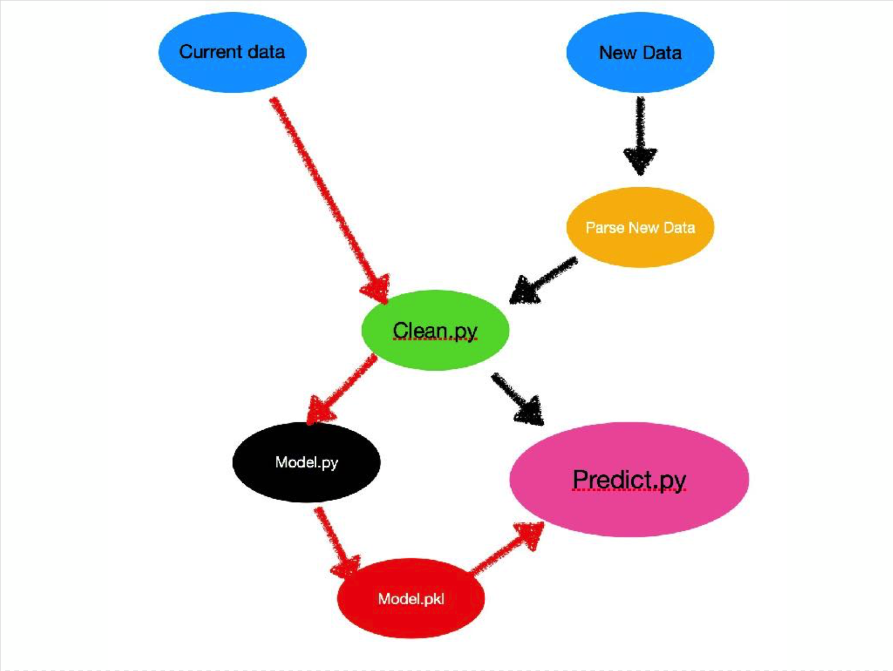

# Fraud Case Study For Galvanize
*See fraud.pdf to see our work*  
  
For this two day case study my team and I engineered an end to end pipeline for predicting fraud from streaming data.  
 
  
## The Process
We spent most of the first day doing EDA, choosing the most important features from the original 44, and better understanding our data. Our training dataset consisted of 14,337 events that were labeled as some type of fraud or not. After modeling, we performed a cost analysis to give the company some options. 

## Modeling
After choosing the features we wanted to keep, we utilized RandomUnderSampler to fix our class imbalance and improve the accuracy our model. We then started testing different models using F1 score as our performance metric. We started with Naive Bayes, moved on to Logistic Regression, Decision Tree, Gradient Boosted Trees, and Random Forests. Most of these models gave pretty good accuracy, but we decided on a Random Forest Classifier because it gave us the highest F1 score.

## Cost Analysis
For the cost analysis, we had to make a few assumptions:  
- average payment per customer **$1100**
- the chance of churn for a customer investigated (churning due to inconvenience) **1/100**
- average cost of predicting fraud when they're not (false positive) **$220**
- average cost of predicting not fraud when they are (false negative) **$1100**

