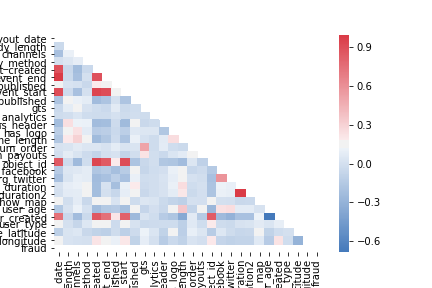
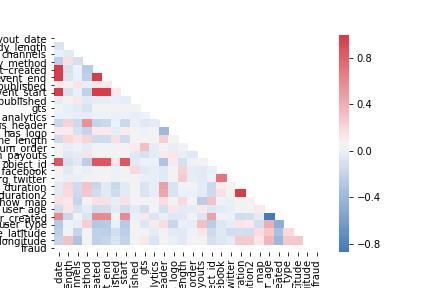

# Fraud Case Study For Galvanize
*See fraud.pdf to see our work*  
For this two day case study my team and I engineered an end to end pipeline for predicting fraud from streaming data.  
  
## The Process
We spent most of the first day doing EDA, choosing the most important features from the original 44, and better understanding our data. Our training dataset consisted of 14,337 events that were labeled as some type of fraud or not. Below are two heatmaps, one for the fraud events, and one for the non-fraud events.  
  
### Fraud
 
  
### Not Fraud
 
  
